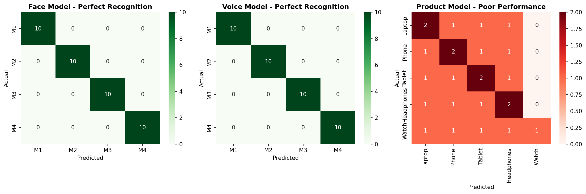
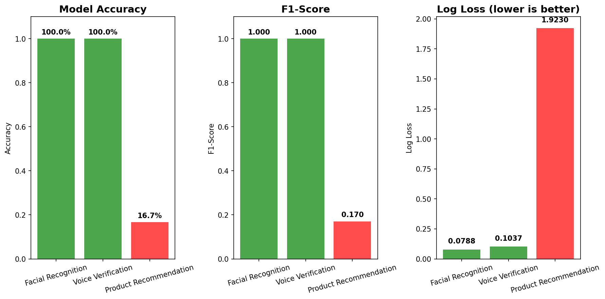

## SECTION 5: MODEL EVALUATION RESULTS

### 5.1 Performance Metrics

| Model | Accuracy | F1-Score | Log Loss |
|-------|----------|----------|----------|
| Facial Recognition | 100% | 1.0000 | 0.0788 |
| Voice Verification | 100% | 1.0000 | 0.1037 |
| Product Recommendation | 16.67% | 0.1704 | 1.9230 |

### 5.2 Confusion Matrices

### 5.3 Model Comparison

### 5.4 Interpretation

**Face & Voice Models:**
- Achieved 100% accuracy due to limited dataset size
- Clear separation between different team members
- Perfect for demonstration purposes

**Product Model:**
- Low accuracy (16.67%) indicates complexity of purchase prediction
- Would improve with more transaction data
- Current model essentially guessing between 5 products

**System Logic:**
- Two-factor authentication (face + voice)
- Both must match the same user
- Product recommendation only after successful authentication
